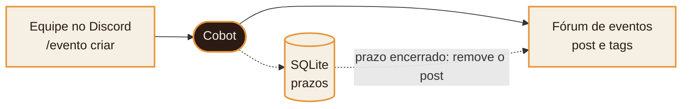
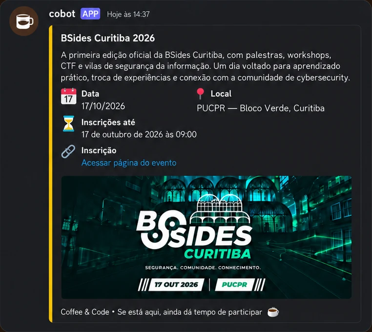
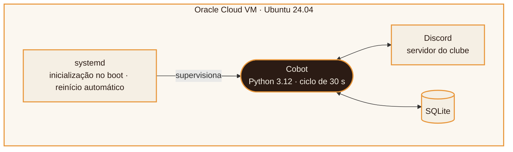

  

<h1 align="center">Cobot</h1>

  Automação da divulgação de eventos no Discord do <strong>Coffee &amp; Code</strong>, clube de tecnologia da PUCPR.

---

## Visão geral

O Cobot é um bot de Discord desenvolvido em Python que automatiza o ciclo de vida das
publicações de eventos do clube. A equipe cadastra um evento com um único comando; o bot
publica o post no fórum com as tags adequadas e o remove automaticamente quando o prazo de
inscrição termina.

O projeto está em produção, operando 24 horas por dia. Este repositório reúne a documentação
de funcionamento, arquitetura e decisões técnicas; o código-fonte é mantido em repositório privado.

## O problema

Cada evento divulgado exigia o mesmo processo manual:

| Etapa | Tarefa | Situação |
| :-: | --- | --- |
| 1 | Encontrar o evento | Manual |
| 2 | Escrever o post no fórum | Manual |
| 3 | Adicionar as tags corretas | Manual |
| 4 | Acompanhar o prazo de inscrição | Frequentemente esquecida |
| 5 | Remover o post após o prazo | Frequentemente esquecida |

As duas últimas etapas raramente eram cumpridas. Como consequência, o fórum acumulava
eventos com inscrições já encerradas.

## A solução

O Cobot concentra as cinco etapas em um único comando e assume o acompanhamento dos prazos.

1. **Comando.** Um membro da equipe executa `/evento criar` no canal de staff, único canal em que o comando é aceito.
2. **Publicação.** O bot monta o post e o publica no fórum, aplicando as tags correspondentes aos dados informados.
3. **Registro.** O evento e o prazo de inscrição são persistidos em SQLite, o que preserva o estado em caso de reinício.
4. **Monitoramento.** A cada 30 segundos, o bot verifica os prazos vencidos.
5. **Remoção.** Encerrado o prazo, o post é excluído do fórum e o evento deixa a lista de ativos.

## Em funcionamento

  

| Recurso | Descrição |
| --- | --- |
| Tags automáticas | Os dados informados no comando são associados às tags do fórum. |
| Prazo localizado | O fim das inscrições é exibido no formato de horário nativo do Discord, ajustado ao fuso de cada leitor. |
| Remoção automática | Os prazos são verificados a cada 30 segundos e o post é removido no vencimento. |

### Parâmetros do comando `/evento criar`

| Campo | Descrição |
| --- | --- |
| `titulo` | Nome do evento |
| `descricao` | Texto de divulgação |
| `data` | Data de realização |
| `prazo` | Fim das inscrições; define quando o post será removido |
| `local` | Local de realização |
| `link` | Link de inscrição |
| `tipo` | Categoria do evento, usada nas tags |
| `modalidade` | Presencial ou online, usada nas tags |
| `valor` | Gratuito ou pago |
| `tema` | Área ou assunto, usado nas tags |
| `imagem` | Opcional; capa do post |

## Arquitetura

| Camada | Tecnologia |
| --- | --- |
| Linguagem | Python 3.12 |
| Integração com o Discord | discord.py (slash commands) |
| Persistência | SQLite |
| Supervisão do processo | systemd |
| Hospedagem | Oracle Cloud (Always Free), Ubuntu 24.04 |

Em um teste de resiliência, o processo foi encerrado à força em produção e o systemd
restabeleceu o serviço em cerca de 14 segundos, sem intervenção manual.
Detalhes em [docs/INFRAESTRUTURA.md](docs/INFRAESTRUTURA.md).

## Resultados

| Indicador | Valor |
| --- | --- |
| Etapas manuais por evento | de 5 para 1 comando |
| Intervalo de verificação de prazos | 30 s |
| Memória em produção | 32 MB |
| Tempo de recuperação após falha | ~14 s |
| Custo mensal de hospedagem | R$ 0 |

## Evolução

1. Desenvolvimento do bot em Python com discord.py.
2. Primeira versão hospedada na Discloud.
3. Migração para a Oracle Cloud, após o esgotamento de vagas no plano gratuito da Discloud.
4. Operação contínua em produção como serviço do systemd.

## Documentação

- [Infraestrutura](docs/INFRAESTRUTURA.md): hospedagem, supervisão do processo e resiliência.
- [Decisões técnicas](docs/DECISOES.md): escolhas de projeto e suas justificativas.

## Autoria

Desenvolvido por [Giovanna Ribas dos Reis](https://github.com/ribasgiovanna), fundadora do
Coffee &amp; Code.

© 2026 Giovanna Ribas dos Reis. Todos os direitos reservados.
